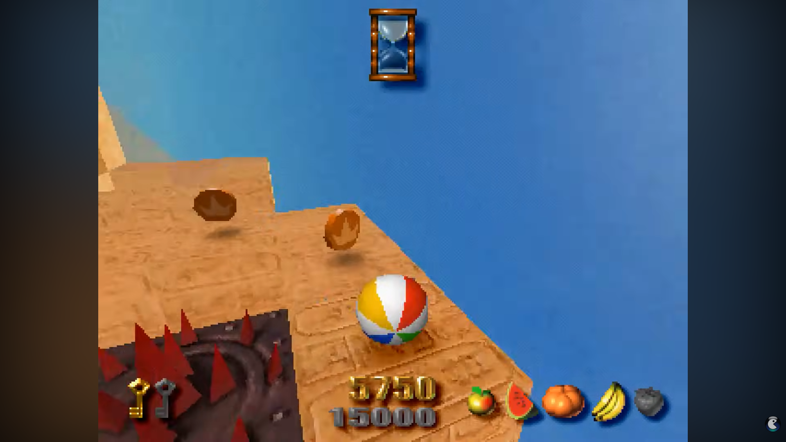
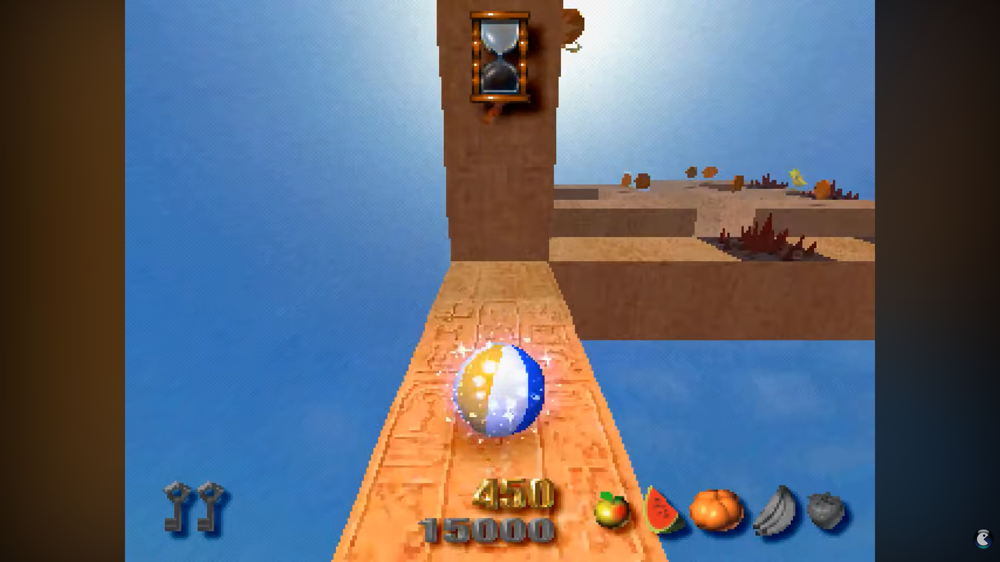
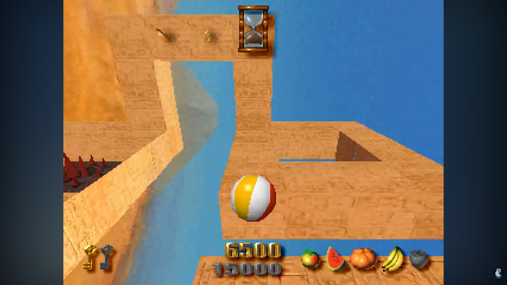

# Especificação da Implementação

> [!CAUTION]
>
> - Você <ins>**não pode utilizar ferramentas de IA para escrever esta
>   especificação**</ins>

> [!WARNING]
>
> - Após a entrega da primeira versão completa, esta especificação não
>   poderá ser alterada. A implementação final deverá corresponder ao que
>   estiver descrito neste arquivo.

## Integrantes da dupla

- **Aluno 1 - Nome**: <mark>`Gabriel Barbosa Taffarel`</mark>
- **Aluno 1 - Cartão UFRGS**: <mark>`00297549`</mark>

- **Aluno 2 - Nome**: <mark>`Pedro Fantin da Silva`</mark>
- **Aluno 2 - Cartão UFRGS**: <mark>`00228481`</mark>

## Detalhes do que será implementado

- **Título do trabalho**: <mark>`<preencher>`</mark>
- **Parágrafo curto descrevendo o que será implementado**: <mark>Será implementado um clone do jogo Kula World, lançado originalmente para o Playstation. O jogador controla uma bola percorrendo um ambiente de plataformas 3D. O jogador deve encontrar uma chave e se dirigir a saída do nível coletando itens bonus e evitando obstáculos no caminho utilizando a habilidade de mudar sua orientação ao trocar de superfície.</mark>

> Comentário Professor: Considerem os efeitos visuais adicionais mencionados, como o skybox, os brilhos coloridos, a deformação da bola e o detalhamento das plataformas, requisitos de fidelidade visual à referência que vocês escolheram.

## Especificação visual

### Vídeo - Link

> [!IMPORTANT]
>
> - Coloque aqui um link para um vídeo que mostre a aplicação gráfica
>   de referência que você vai implementar. **Sua implementação deverá
>   ser o mais parecido possível com o que é mostrado no vídeo (mais
>   detalhes abaixo).**
> - **Você não pode escolher como referência: (1) algum trabalho realizado
>   por outros alunos desta disciplina, em semestres anteriores. (2) Minecraft.**
> - Por exemplo, você pode colocar um vídeo de um jogo que você gosta,
>   e seu trabalho final será uma re-implementação do jogo.
> - O vídeo pode ser um link para YouTube, Google Drive, ou arquivo mp4 dentro
>   do próprio repositório. Mas, garanta que qualquer um tenha
>   permissão de acesso ao vídeo através deste link.

<mark>`https://youtu.be/v4Z8w3A2AOQ`</mark>

### Vídeo - Timestamp

> [!IMPORTANT]
>
> - Coloque aqui um **intervalo de ~30 segundos** do vídeo acima, que
>   será a base de comparação para avaliar se o seu trabalho final
>   conseguiu ou não reproduzir a referência.

- **Timestamp inicial**: <mark>`2:38`</mark>
- **Timestamp final**: <mark>`3:03`</mark>

### Imagens

> [!IMPORTANT]
>
> - Coloque aqui **três imagens** capturadas do vídeo acima, que você
>   irá usar como ilustração para as explicações que vêm abaixo.
> - As imagens devem estar armazenadas neste repositório, no diretório
>   `images/spec/`, com os nomes `image1`, `image2` e `image3`.
> - Cada imagem deve usar o formato `.jpg` ou `.png`. Ajuste a extensão
>   nos vínculos abaixo para que corresponda ao arquivo armazenado.
> - Escolha imagens que correspondam a momentos do intervalo indicado
>   acima ou que sejam relevantes para a comparação com a implementação.

#### Imagem 1

- **Descrição**: <mark>`2:50`</mark>

#### Imagem 2

- **Descrição**: <mark>`2:42`</mark>

#### Imagem 3

- **Descrição**: <mark>`2:54`</mark>

## Especificação textual

Para cada um dos requisitos abaixo (detalhados no [Enunciado do Trabalho final - Moodle](https://moodle.ufrgs.br/mod/assign/view.php?id=6302370)), escreva um parágrafo **curto** explicando como este requisito será atendido, apontando itens específicos do vídeo/imagens que você incluiu acima que atendem estes requisitos.

### Malhas poligonais complexas

<mark>`Os itens colecionáveis terão suas malhas substituidas por modelos mais complexos para atender a este requisito.`</mark>

> Comentário Professor: Detalhem suficientemente a geometria das plataformas para reproduzir, da forma mais fiel possível, as plataformas do jogo original. Utilizem plataformas com geometrias variadas, que proporcionem uma jogabilidade interessante.

> Comentário Professor: Implementem um skybox com a imagem de fundo, reproduzindo o ambiente visual do jogo original.

### Transformações geométricas controladas pelo usuário

<mark>`O usuário controla a translação da bola através de movimento e saltos e rotaciona a câmera.`</mark>

> Comentário Professor: Permitam que a bola se movimente em várias direções. No jogo, não há uma direção fixa de gravidade: vocês devem permitir que a bola fique aderida às paredes e se desloque sobre diferentes superfícies.

> Comentário Professor: Façam o rolamento da bola ser fisicamente coerente. Quando ela rolar, façam sua textura girar corretamente, acompanhando o movimento.

> Comentário Professor: Durante o salto, a bola apresenta uma animação de deformação (squish), sendo comprimida e escalada. Implementem esse efeito.

> Comentário Professor: Na especificação, vocês mencionam que o usuário controla a translação da bola. Considerem também que, durante o rolamento, o usuário controla indiretamente a rotação da bola.

### Diferentes tipos de câmeras

<mark>`A câmera em terceira pessoa que segue a bola é uma câmera orbital com 4 direções fixas, será icluído um modo de visão em primeira pessoa`</mark>

### Instâncias de objetos

<mark>`Intens colecionáveis (moedas) serão instanciados.`</mark>

### Testes de intersecção

<mark>`A colisão com colecionáveis e obstaculos será implementada por testes de intersecção.`</mark>

### Modelos de Iluminação em todos os objetos

<mark>`Originalmente a iluminação parece estar "escrita" nas texturas dos objetos más implementaremos o modelo de Phong com luz ambiente para todos os objetos.`</mark>

> Comentário Professor: Diferenciem claramente os materiais dos objetos por meio do modelo de iluminação. Por exemplo, deem à bola um aspecto mais plástico e às moedas uma aparência metalizada. Talvez o modelo de Phong seja simples demais para vocês evidenciarem essas diferenças.

> Comentário Professor: Quando a bola coleta itens, aparecem brilhos coloridos que vocês devem implementar como efeitos de iluminação. Esses efeitos são independentes do sistema de partículas. Não vejo problema em vocês deixarem de implementar as partículas, conforme indicaram na especificação, mas implementem os efeitos de iluminação durante a coleta.

### Mapeamento de texturas em todos os objetos

<mark>`Todos os objetos tem texturas mapeadas.`</mark>

### Movimentação com curva Bézier cúbica

<mark>`A elevação durante o salto será computada com uma curva de Bézier cúbica.`</mark>

### Animações baseadas no tempo ($\Delta t$)

<mark>`A rotação da bola é calculada relativa ao tempo após o input do usuário. A rotação da placa "Exit" é baseada no tempo.`</mark>

> Comentário Professor: Baseiem no tempo tanto a translação quanto a rotação da bola, incluindo a aceleração, para que a movimentação não dependa da velocidade de processamento.

### Funcionalidade extra obrigatória

> [!IMPORTANT]
>
> - Descreva a funcionalidade extra relacionada à Computação Gráfica
>   que será implementada.
> - Esta funcionalidade também deverá ser documentada no arquivo
>   `README.md` da entrega final.

<mark>`Objetos exceto as plataformas terão sombras projetadas. Será implementado uma HUD com informações para o jogador.`</mark>

> Comentário Professor: Vocês afirmam que implementarão sombras projetadas pelos objetos, exceto pelas plataformas. Esclareçam o que significa essa exceção, distinguindo os objetos que projetam sombras daqueles que recebem sombras.

## Limitações esperadas

> [!IMPORTANT]
>
> - Coloque aqui uma lista de detalhes visuais ou de interação que
>   aparecem no vídeo e/ou imagens acima, mas que você **não pretende
>   implementar** ou que você **irá implementar parcialmente**.
> - Para cada item, **explique por que** não será implementado ou por
>   que será implementado parcialmente.

<mark>`Efeitos volumétricos não serão implementados. Serão excluídas as telas de início/fim de nível. Efeitos de particula como os que ocorrem ao coletar intens não serão implementados.`</mark>

> Comentário Professor: Vocês mencionam que não implementarão efeitos volumétricos. Esclareçam quais são esses efeitos e o que exatamente pretendem deixar de implementar.
